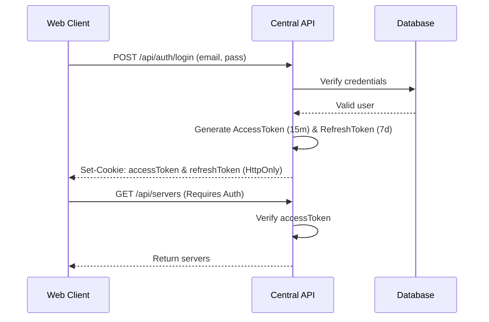
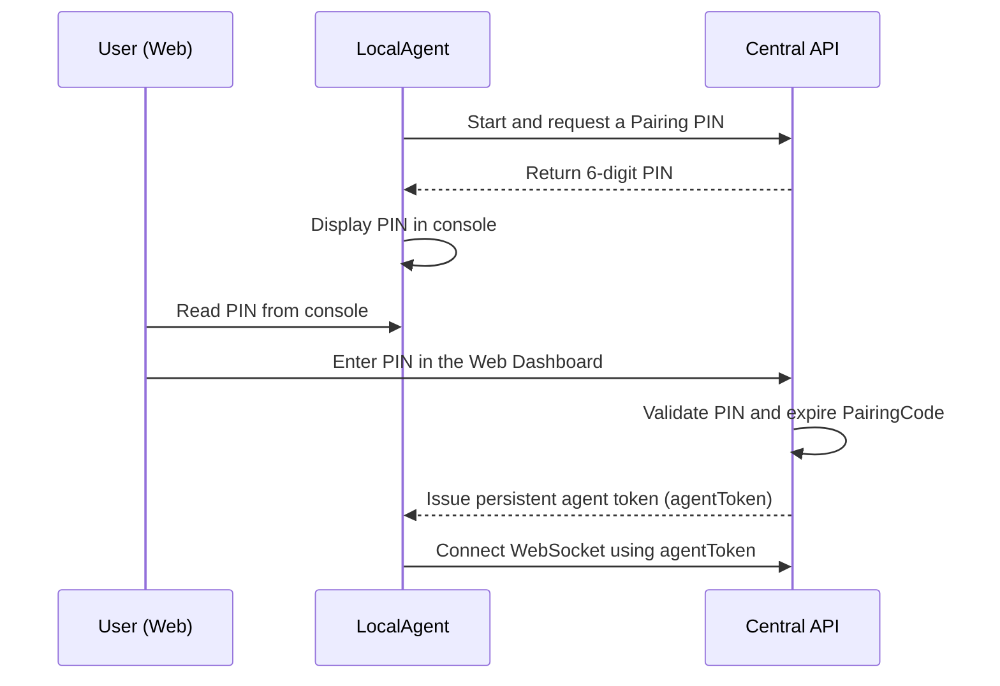
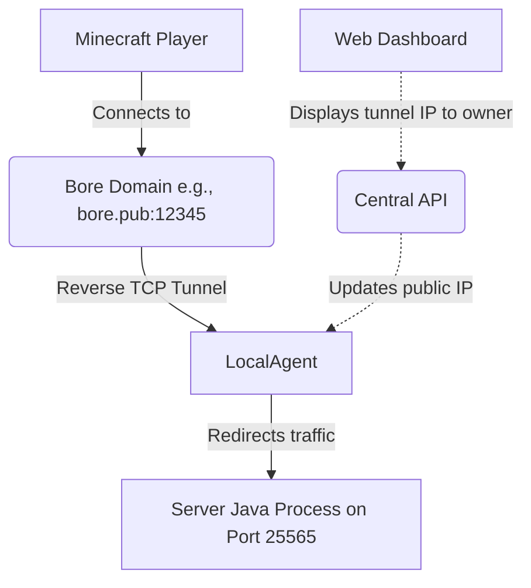
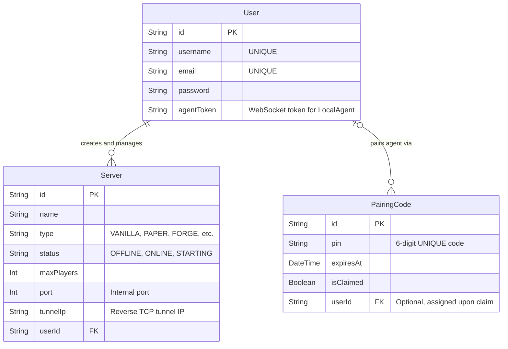

# System Architecture & Logic (CraftControl)

This document details the structure and data flow of the **CraftControl** ecosystem. The objective is to understand how the three main modules (`Web`, `API`, and `LocalAgent`) interact with each other.

## 1. System Topology

CraftControl is composed of three key pieces:

1. **Web Dashboard (Next.js):** The user-facing graphical interface.
2. **Central API (Express.js):** The orchestrator of the database and WebSocket connections.
3. **LocalAgent (Node.js daemon):** A lightweight client that runs on the host machine where the servers will reside. It executes Java processes and exposes ports.

## 2. Authentication Flow (JWT)

The system uses a JWT-based authentication model with Refresh Tokens to ensure session persistence.

## 3. Local Agent Pairing Flow

For the Web Dashboard to control servers on a user's machine, the user must pair their LocalAgent with the API using a securely generated random PIN.

## 4. Network Architecture & TCP Tunnel (Bore)

The `LocalAgent` spins up the Minecraft server locally. So that external players can connect without requiring the host to open ports on their router (Port Forwarding), CraftControl utilizes TCP tunnels.

## 5. Database Schema (Entity-Relationship Diagram)

The database (PostgreSQL via Prisma) manages users, their servers, and temporary pairing codes.

